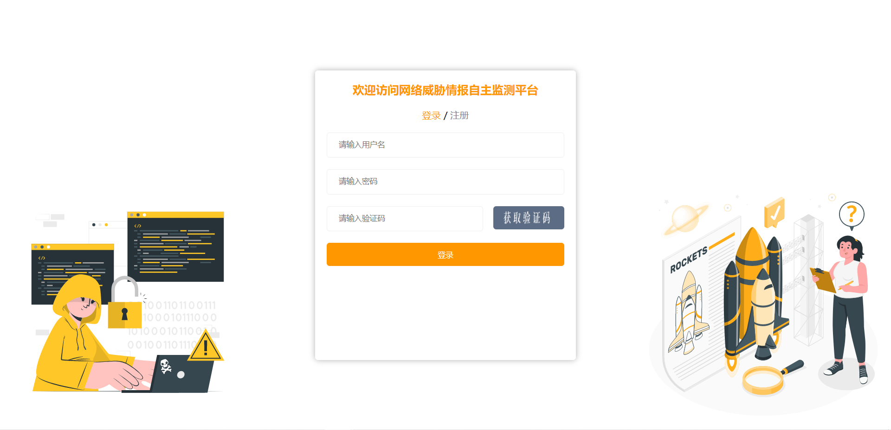
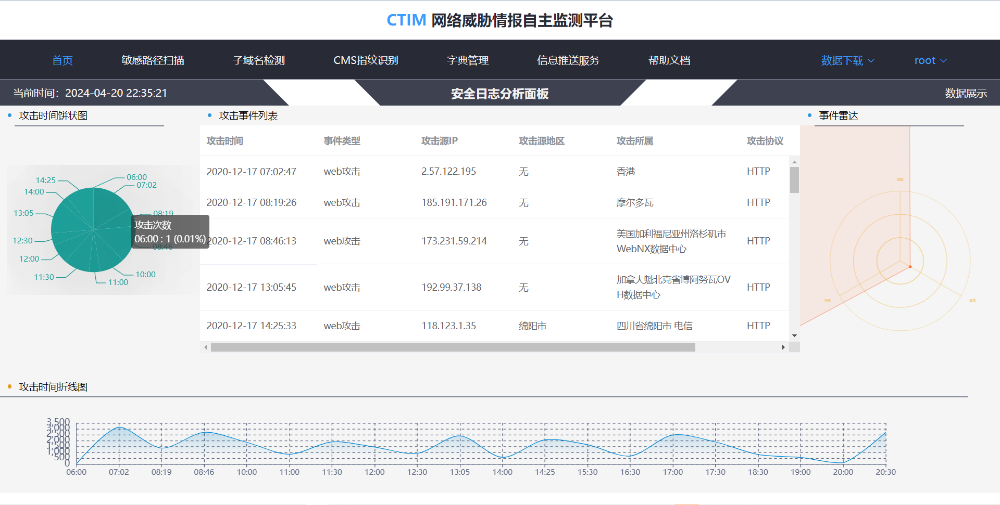
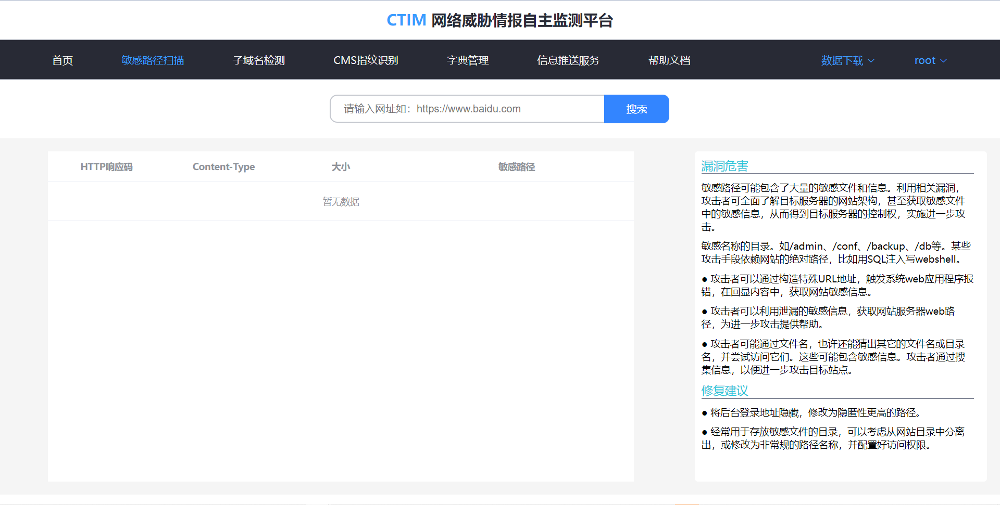
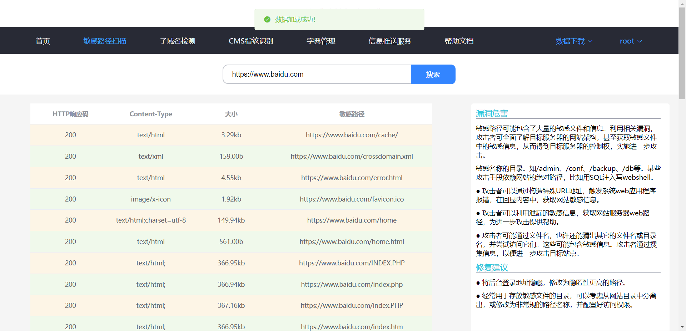
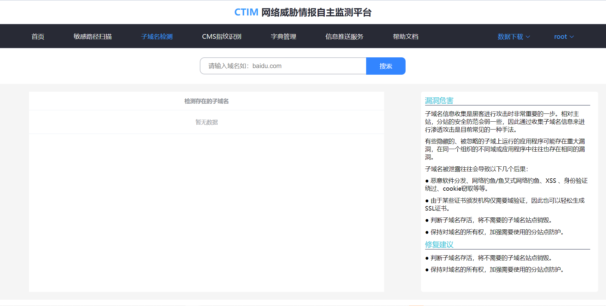
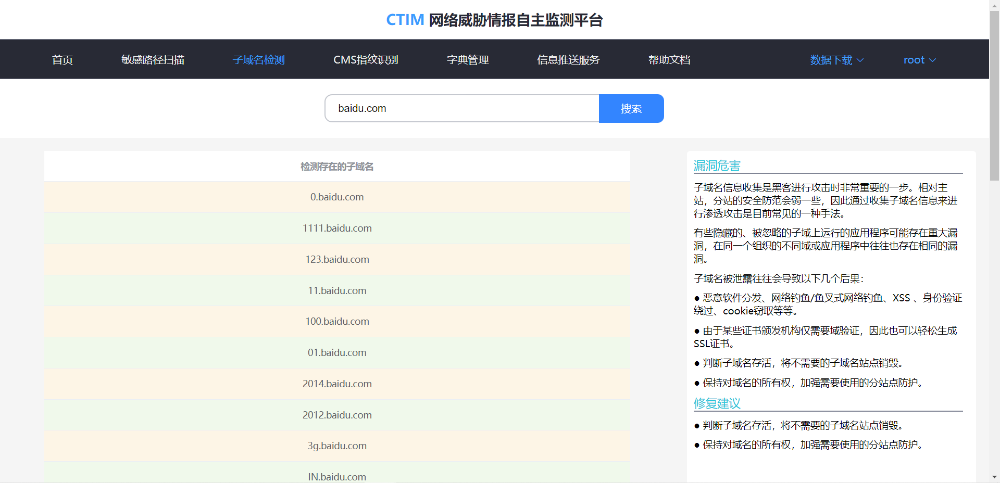
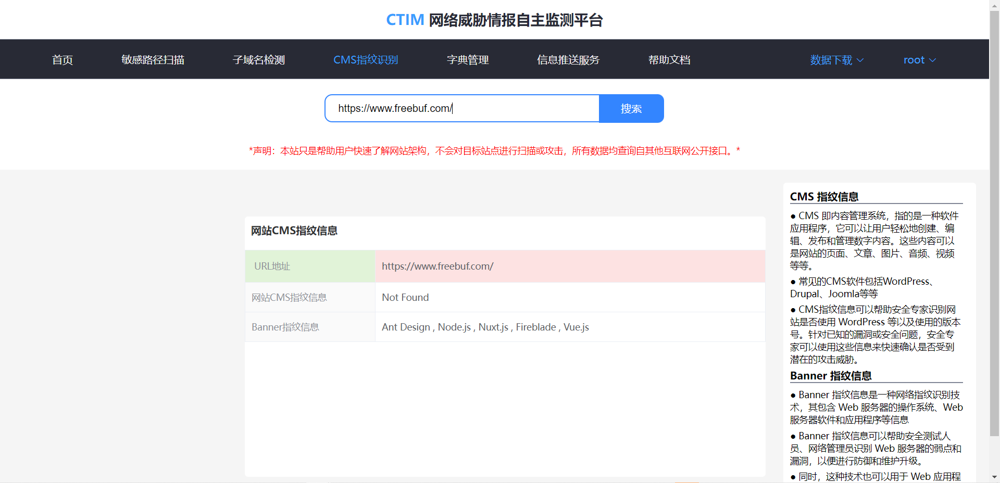
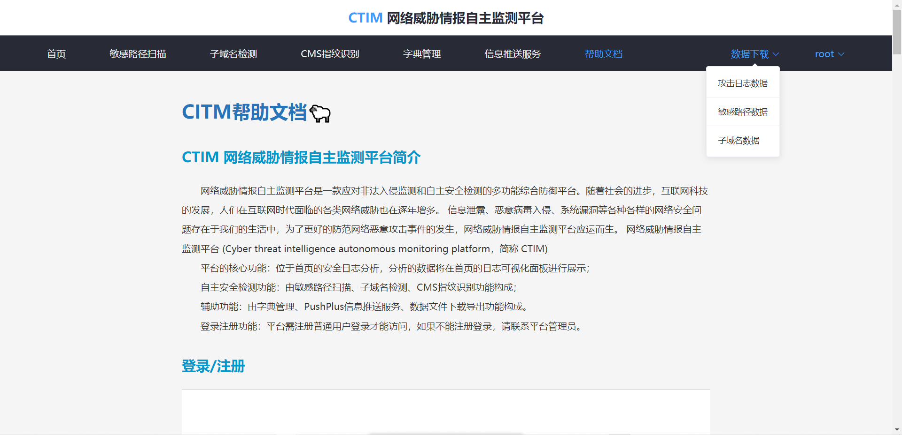

生成环境启动程序命令：python manage.py runserver --insecure

或者指定端口：python manage.py runserver 8001 --insecure

生产环境在 settings.py 文件中修改为：

DEBUG = False
ALLOWED_HOSTS = ['*']

开发环境为：

DEBUG = True

ALLOWED_HOSTS = []

- 登陆注册界面

